# Data Marketing Agent Team

네이버 API 데이터를 활용한 AI 마케팅 에이전트 팀입니다.

## 설치

```bash
pip install streamlit streamlit-autorefresh openai
```

## 실행

### 대시보드 (라이브 모니터링)
```bash
streamlit run dashboard.py
```

### CLI 모드
```bash
# 테스트 모드 (에이전트 로딩 확인)
python main.py --test

# 분석 실행
python main.py --query "에어팟 맥스 마케팅 분석"
```

## 프로젝트 구조

```
entropic-cosmic/
├── agents/                     # 에이전트 정의 (Markdown)
│   ├── orchestrator/
│   │   ├── planner.md         # 기획 총괄
│   │   └── reviewer.md        # 품질 검수
│   ├── data_team/
│   │   ├── trend-analyst.md   # 트렌드 분석
│   │   ├── keyword-researcher.md
│   │   ├── price-monitor.md
│   │   └── review-analyst.md
│   └── content_team/
│       ├── product-copywriter.md
│       └── report-generator.md
├── skills/                     # API 가이드
│   └── naver_api/
│       ├── search_ad.md
│       ├── shopping.md
│       └── datalab.md
├── outputs/                    # 실행 결과물
├── config.py                   # 설정 로더
├── logger.py                   # 실시간 로깅
├── main.py                     # 메인 실행
└── dashboard.py                # 라이브 대시보드
```

## 🏢 팀 구조 (조직도)

```mermaid
graph TD
    A["사용자 요청"] --> B["Planner<br>기획 총괄"]
    
    B --> C["Data Team<br>(병렬 실행)"]
    C --> C1["Trend Analyst<br>데이터랩 추세"]
    C --> C2["Keyword Researcher<br>검색광고 분석"]
    C --> C3["Price Monitor<br>가격 모니터링"]
    C --> C4["Review Analyst<br>리뷰/VOC 분석"]
    
    C1 & C2 & C3 & C4 --> D["Content Team<br>(병렬 실행)"]
    D --> D1["Product Copywriter<br>상품 카피"]
    D --> D2["Report Generator<br>분석 리포트"]
    
    D1 & D2 --> E["Reviewer<br>품질 검수 (최종 승인)"]
    E --> F["최종 결과물 출력"]
    
    style A fill:#fff,stroke:#333,stroke-width:2px
    style B fill:#f9f,stroke:#333,stroke-width:2px
    style C fill:#e1f5fe,stroke:#0277bd,stroke-width:2px
    style D fill:#fff3e0,stroke:#ef6c00,stroke-width:2px
    style E fill:#f9f,stroke:#333,stroke-width:2px
    style F fill:#e8f5e9,stroke:#2e7d32,stroke-width:2px
```



| 팀 | 에이전트 | 역할 |
|---|---|---|
| Orchestrator | Planner | 기획 총괄, 작업 분배 |
| Orchestrator | Reviewer | 품질 검수 (최종 승인) |
| Data Team | Trend Analyst | 네이버 데이터랩 트렌드 분석 |
| Data Team | Keyword Researcher | 검색광고 키워드 분석 (API) |
| Data Team | Price Monitor | 쇼핑 가격 모니터링 (API) |
| Data Team | Review Analyst | 리뷰/VOC 분석 |
| Content Team | Product Copywriter | 상품명/설명 최적화 (성분 기반) |
| Content Team | Report Generator | 마케팅 리포트 생성 |

## 환경 변수

```bash
# OpenAI API (main.py에서 LLM 호출에 사용)
export OPENAI_API_KEY="your-api-key"

# 네이버 API (skills에서 참조)
export NAVER_CLIENT_ID="your-client-id"
export NAVER_CLIENT_SECRET="your-client-secret"
```
